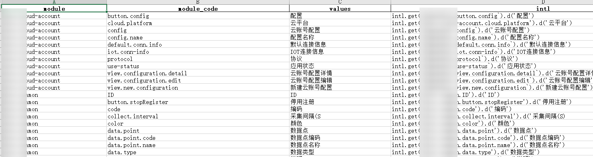
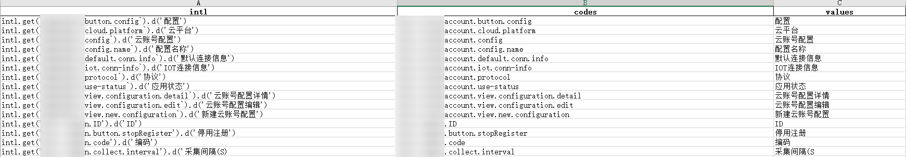

# utils
## 数据加密工具
python3.6.5测试通过
加密库安装：pip install pycrypto

非对称加密使用示例：  
&emsp;&emsp;实例化一个对象：
```
obj = DataEncryption.AsymmetricEncryption()
```  
&emsp;&emsp;生成公钥及私钥：
```
public_key, private_key = obj.generate_secret_key(length=1024)
```  
&emsp;&emsp;对数据进行加密、签名，私钥是可选的，如不传入则相应的签名为None：
```
data, sig = obj.data_encryption_signer(source_data=s, pub_key=public_key)
```  
&emsp;&emsp;使用私钥对数据进行解密：
```
d_data = obj.decrypt(data, private_key)
```

## Hzero 国际化抽取工具
依赖pandas版本0.24.2

使用方法：将脚本文件拷贝到需要抽取国际化的目录下执行即可

get_intl_all.py: 抽取所有的国际化

get_intl_for_standard.py: 抽取标准的国际化配置，将忽略hzero.common开头的国际化配置


<br />

